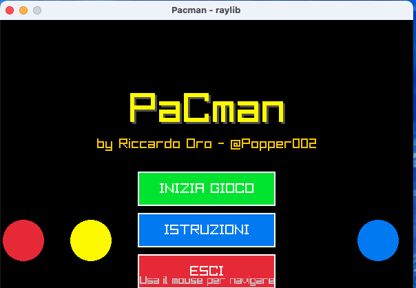
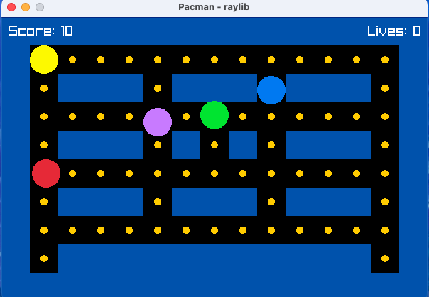
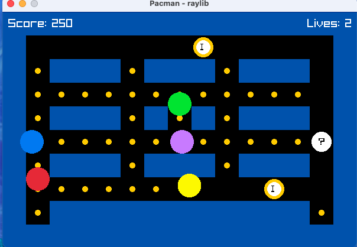

# PaCman - Modern Pacman Game in C

A modern implementation of the classic Pacman game built with C and raylib. This project features enhanced gameplay mechanics, power-ups, multiple game states, and improved AI for an engaging gaming experience.



## Project Origin

This project was born from the desire to start studying the C programming language in depth, particularly in the field of graphics programming. The goal was to explore low-level programming concepts while creating an engaging, interactive application that demonstrates practical C programming skills in game development and computer graphics.

## Features

### Core Gameplay
- **Classic Pacman Mechanics**: Navigate the maze, collect dots, and avoid ghosts
- **Power Pellets**: Collect power pellets to temporarily make ghosts vulnerable
- **Score System**: Earn points by collecting dots and eating ghosts
- **Lives System**: Start with 3 lives, lose one when caught by a ghost

### Enhanced Features
- **Power-Up System**: Five different power-ups with unique effects:
  - 🏃 **Speed Boost**: Increases Pacman's movement speed
  - 🛡️ **Invincibility**: Temporary immunity to ghost collisions
  - ⭐ **Score Boost**: Double points for a limited time
  - 🐌 **Slow Ghosts**: Reduces ghost movement speed
  - ❤️ **Extra Life**: Grants an additional life

- **Multiple Game States**:
  - **Home Screen**: Animated welcome screen with game title
  - **Instructions**: Detailed gameplay instructions and controls
  - **Playing**: Main game experience
  - **Game Over**: Final score display and restart options

- **Improved Ghost AI**: Enhanced pathfinding and behavioral patterns
- **Visual Effects**: Smooth animations and visual feedback
- **Interactive UI**: Mouse-based navigation with button highlighting

## Game Screenshots

## Power-Up System

## Power-Up Action
 


## Installation & Compilation

### Prerequisites
- GCC compiler
- Make utility
- raylib library (included in `src/utils/raylib/`)

### Build Instructions

1. **Clone the repository**:
   ```bash
   git clone <repository-url>
   cd PaCman
   ```

2. **Build the project**:
   ```bash
   make
   ```

3. **Run the game**:
   ```bash
   ./pacman
   ```

4. **Clean build files** (optional):
   ```bash
   make clean
   ```

### Manual Compilation

If you prefer to compile manually:

```bash
gcc -o pacman src/main.c src/pacman.c \
    -Isrc/utils/raylib/src \
    -Lsrc/utils/raylib/src \
    -lraylib -lGL -lm -lpthread -ldl -lrt -lX11
```

## Controls

### Menu Navigation
- **Mouse**: Hover over buttons to highlight, click to select
- **Enter**: Select highlighted option (keyboard navigation)
- **Escape**: Return to previous screen or quit game

### Gameplay Controls
- **Arrow Keys** / **WASD**: Move Pacman
- **Escape**: Pause game or return to menu
- **R**: Restart current level (when game over)

## Game Mechanics

### Scoring System
- **Dot**: 10 points
- **Power Pellet**: 50 points
- **Ghost (vulnerable)**: 200 points (doubles with each subsequent ghost)
- **Power-up**: 100 points

### Power-Up Effects
| Power-Up | Duration | Effect |
|----------|----------|---------|
| Speed Boost | 8 seconds | 1.5x movement speed |
| Invincibility | 6 seconds | Immune to ghost collisions |
| Score Boost | 10 seconds | 2x points for all actions |
| Slow Ghosts | 12 seconds | 0.5x ghost movement speed |
| Extra Life | Instant | +1 life (max 5 lives) |

### Ghost Behavior
- **Normal State**: Actively chase Pacman
- **Vulnerable State**: Flee from Pacman (after power pellet)
- **Respawn**: Return to center after being eaten

## Project Structure

```
PaCman/
├── src/
│   ├── main.c              # Main game loop and state management
│   ├── pacman.c            # Game logic and power-up system
│   ├── lib/
│   │   ├── common.h        # Shared constants and structures
│   │   └── pacman.h        # Function declarations
│   └── utils/
│       └── raylib/         # raylib graphics library
├── screenshots/            # Place your JPEG screenshots here
├── Makefile               # Build configuration
└── README.md              # This file
```

## Code Architecture

### State Management
The game uses a state machine with four main states:
- `HOME`: Welcome screen with animated title
- `INSTRUCTIONS`: Gameplay instructions and controls
- `PLAYING`: Main game experience
- `GAME_OVER`: Score display and restart options

### Modular Design
- **main.c**: Handles the main game loop, rendering, and state transitions
- **pacman.c**: Contains game logic, power-up system, and collision detection
- **common.h**: Defines shared constants, structures, and enums
- **pacman.h**: Declares public functions and interfaces

### Key Features Implementation
- **Power-Up System**: Timer-based effects with visual indicators
- **Collision Detection**: Precise boundary checking for gameplay elements
- **Animation System**: Smooth transitions and visual feedback
- **Input Handling**: Responsive controls for both keyboard and mouse

## Customization

### Adding New Power-Ups
1. Add new power-up type to `PowerUpType` enum in `common.h`
2. Update `InitializePowerUp()` function in `pacman.c`
3. Add effect logic to `UpdatePowerUpEffects()` function
4. Update rendering in `DrawPowerUpIndicators()` function

### Modifying Game Settings
Edit constants in `common.h`:
- `SCREEN_WIDTH` / `SCREEN_HEIGHT`: Window dimensions
- `PACMAN_SPEED` / `GHOST_SPEED`: Movement speeds
- `POWER_UP_DURATION_*`: Power-up effect durations
- `MAX_LIVES`: Maximum number of lives

### Adding New Levels
Modify the maze layout in the `InitializeGame()` function by updating the wall positions and collision boundaries.

## Troubleshooting

### Common Issues

1. **Compilation Errors**:
   - Ensure raylib is properly installed or use the included version
   - Check that all source files are in the correct directories

2. **Runtime Errors**:
   - Verify that the executable has proper permissions
   - Check that all required libraries are available

3. **Performance Issues**:
   - Ensure your system meets the minimum requirements
   - Close other applications if experiencing lag

### Build Problems
If you encounter build issues:
1. Clean the build directory: `make clean`
2. Rebuild: `make`
3. Check compiler and library versions

## Contributing

1. Fork the repository
2. Create a feature branch
3. Make your changes with proper documentation
4. Test thoroughly
5. Submit a pull request

## License

This project is open source. Please respect the raylib license terms for the graphics library.

## Acknowledgments

- **raylib**: Amazing graphics library that made this project possible
- **Classic Pacman**: Original game design inspiration
- **Open Source Community**: Various resources and documentation

---

**Enjoy playing PaCman!** 🎮

For questions, suggestions, or bug reports, please open an issue in the repository.